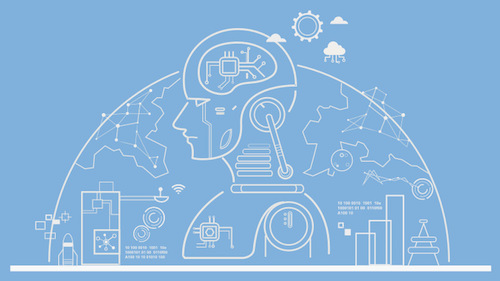
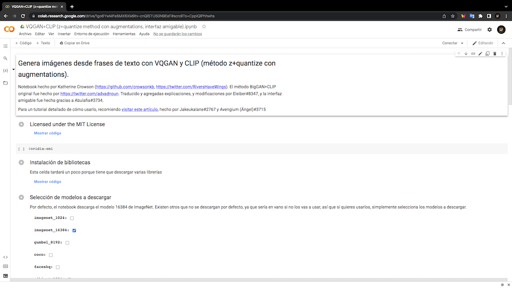

# Nivel 3. Introducción a la IA

 

---
# Práctica 2. Cómo generar una imágen con inteligencia artificial (red generativa antagónica).

#### Por [Emiliano Rodríguez Pérez](https://github.com/Emiliano-RP) #IA Wizards
#### Sherpa: [José Jesús Guzmán Eusebio](https://github.com/josejesusguzman)
---
#### Requisitos:
- Tener un equipo de cómputo con Windows, Linux o MacOs.
- Tener conexión a internet.
---
#### Instrucciones:
1. Para poder generar nuestra imagen nos dirigimos a [VQGAN+CLIP (z+quantize method con augmentations).ipynb](https://colab.research.google.com/drive/1go6YwMFe5MX6XM9tv-cnQiSTU50N9EeT#scrollTo=CppIQlPhhwhs).

2. 

| Hola |---|---|---|
    |---|---|---|---|
    | Hola | Hola | Hola |
    | Hola | Hola | Hola |
    | Hola | Hola | Hola |