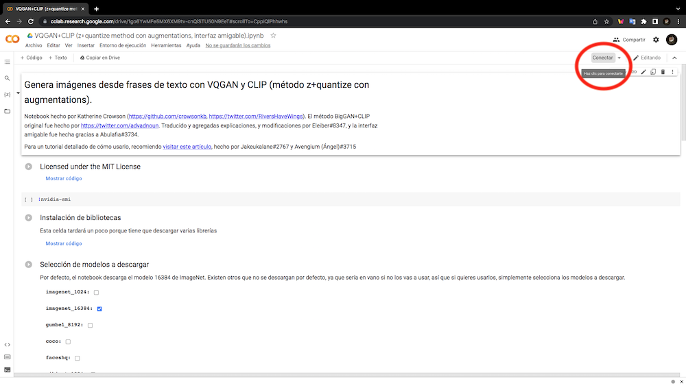
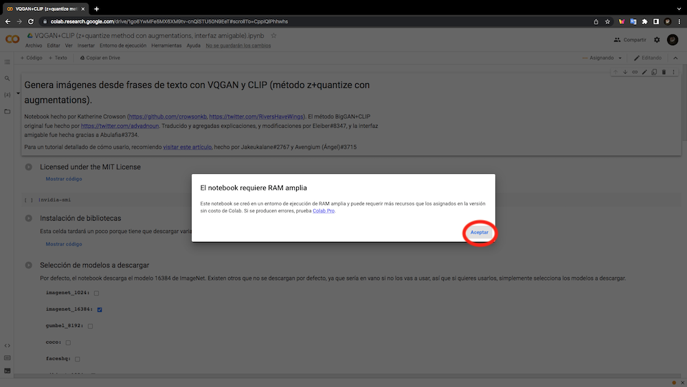
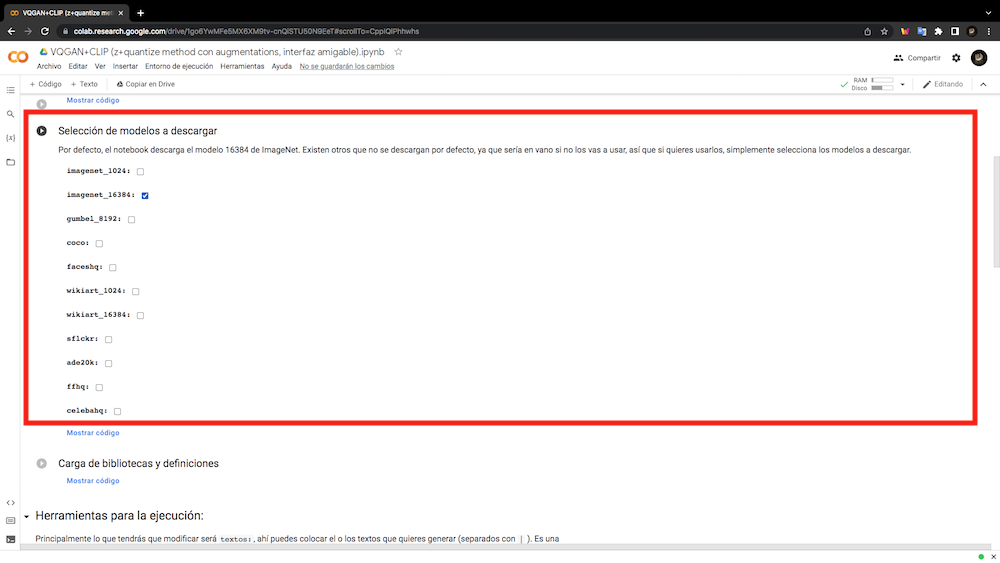
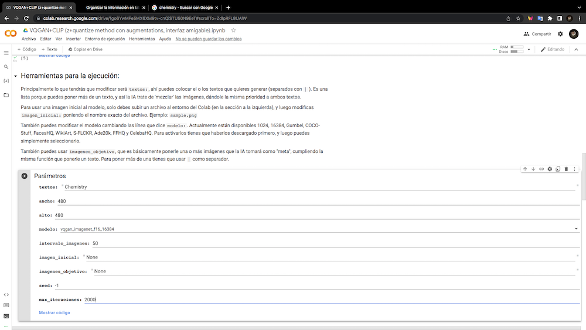
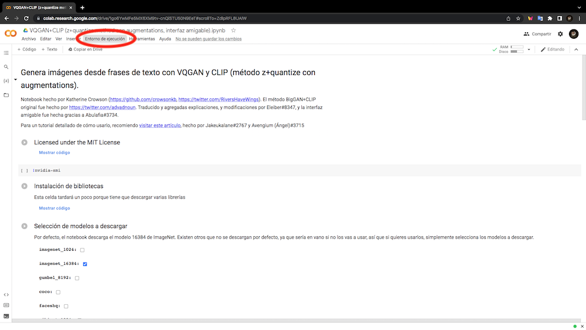
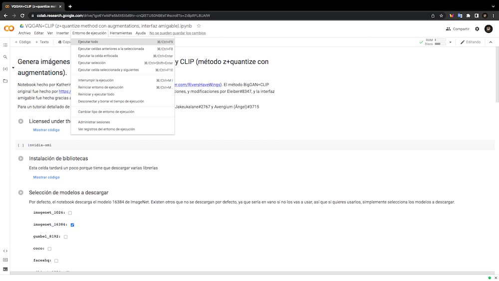
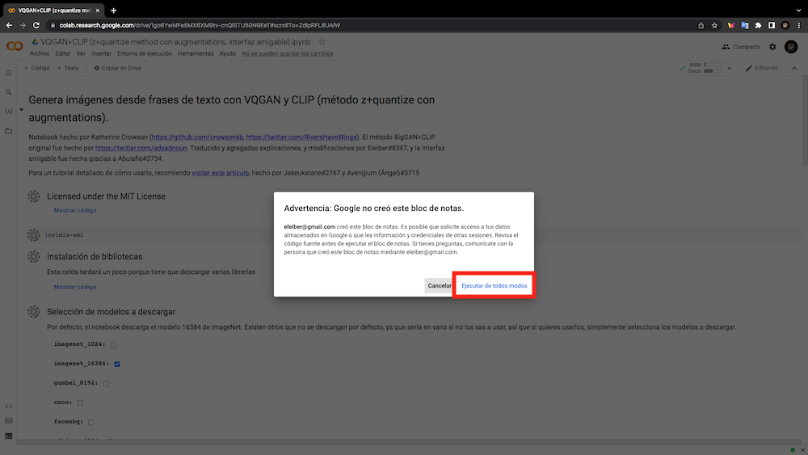
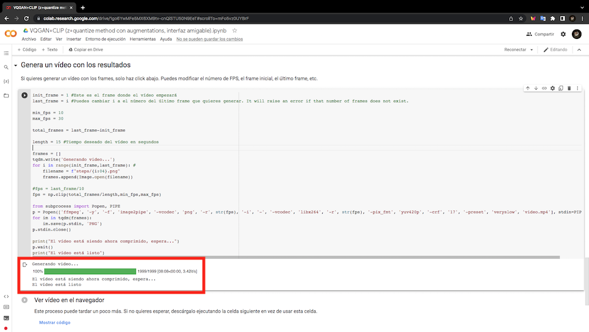
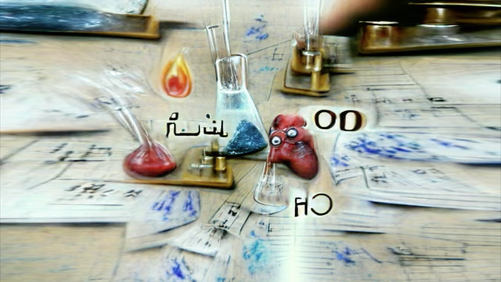
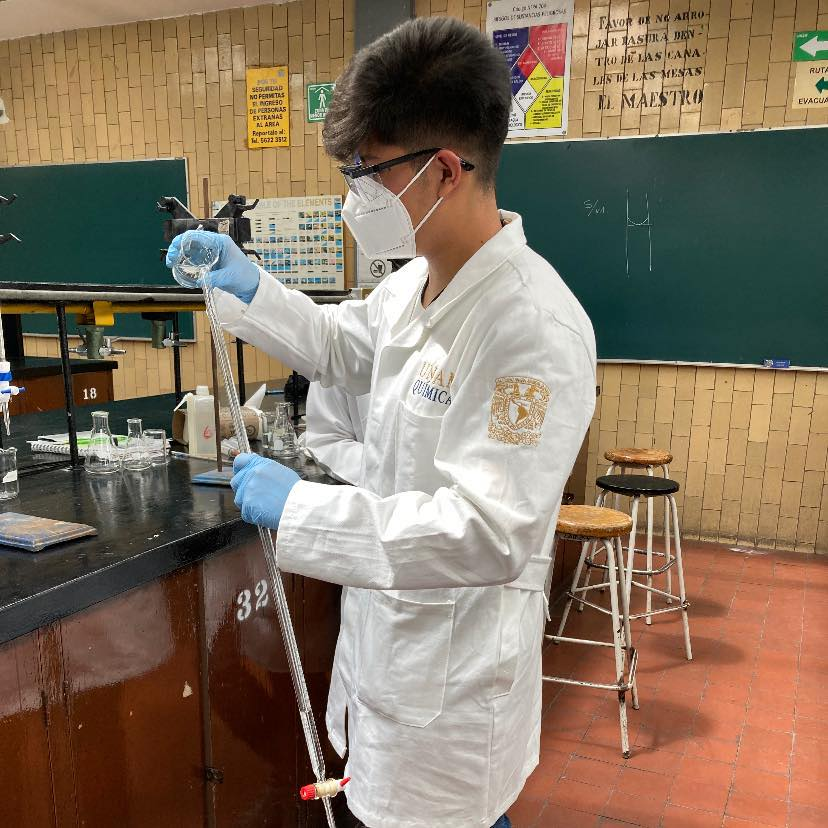

# Nivel 3. Introducción a la IA

 

---
# Práctica 2. Cómo generar una imágen con inteligencia artificial (red generativa antagónica).

#### Por [Emiliano Rodríguez Pérez](https://github.com/Emiliano-RP) #IA Wizards
#### Sherpa: [José Jesús Guzmán Eusebio](https://github.com/josejesusguzman)
---
#### Requisitos:
- Tener un equipo de cómputo con Windows, Linux o MacOs.
- Tener conexión a internet.
---
#### Instrucciones:
1. Para poder generar nuestra imagen nos dirigimos a [VQGAN+CLIP (z+quantize method con augmentations).ipynb](https://colab.research.google.com/drive/1go6YwMFe5MX6XM9tv-cnQiSTU50N9EeT#scrollTo=CppIQlPhhwhs).

2. Damos click en **Conectar** para que se asigne una máquina virtual.

3. Cuando nos aparezca el aviso **"El notebook requiere RAM amplia"**, damos en **Aceptar**.

4. Nos dirigimos al apartado de **"Selección de modelos a descargar"**. Puedes elegir descargar otros modelos pero el modelo por defecto será `imagenet_16384`. `imagenet_1024` es ligero. Los textos como `time total`, `time spent`, `time left` indican cuánto tiempo falta de descarga. Esperamos a que acabe de descargar.

5. Posteriormente debajo de **"Herramientas para la ejecución"**, encontraramos los **"Parámetros"**, los cuales podemos modificar para que la IA genere la imagen con las características que deseemos. Aquí te dejo una tabla de los parámetros que podemos modificar, su descripción y el texto predeterminado que se muestra en la pantalla de [VQGAN+CLIP (z+quantize method con augmentations).ipynb](https://colab.research.google.com/drive/1go6YwMFe5MX6XM9tv-cnQiSTU50N9EeT#scrollTo=CppIQlPhhwhs) :

    | Parámetro | Texto por defecto | Descripción |
    | --------- | ----------- | ------------------- |   
    | `textos` | `A fantasy world` | Este parámetro es el texto que VQGAN+CLIP va a interpretar como concepto de la imagen. Si se escribe "fuego", dibujará fuego, y si se escribe "agua", representará agua.|
    | `ancho` | `480` | El ancho de cada imagen que [VQGAN+CLIP](https://colab.research.google.com/drive/1go6YwMFe5MX6XM9tv-cnQiSTU50N9EeT#scrollTo=CppIQlPhhwhs) generará dentro de esa página de Colaboratory. Se recomienda no modificarlo (más allá de 600) puesto que la máquina virtual tiene una memoria limitada. Es mejor utilizar después [bigjpg](https://bigjpg.com/). Puedes cambiar la proporción para que no sea cuadrada (Una ayuda aquí: [Calculadora de proporciones](https://tools.feline.cl/es/calculadora-de-proporciones/)). |
    | `alto` | `480` | El alto de cada imagen que [VQGAN+CLIP](https://colab.research.google.com/drive/1go6YwMFe5MX6XM9tv-cnQiSTU50N9EeT#scrollTo=CppIQlPhhwhs) generará dentro de esa página de Colaboratory. Se recomienda no modificarlo (más allá de 600) puesto que la máquina virtual tiene una memoria limitada. Es mejor utilizar después [bigjpg](https://bigjpg.com/). También puedes cambiar la proporción. |
    | `modelo` | `imagenet_16384` | Este parámetro decide qué modelo de [VQGAN](https://colab.research.google.com/drive/1go6YwMFe5MX6XM9tv-cnQiSTU50N9EeT#scrollTo=CppIQlPhhwhs) se va a ejecutar. Son cajas que permiten seleccionar uno o varios modelos. El que selecciones tiene que haber sido descargado previamente. El número indica la cantidad de modelos que contiene por lo que `imagenet_16384` es mejor que `imagenet_1024` (aunque más pesado). |
    | `intervalo_imagenes` | `50` | Esto indica al programa cada cuantas iteraciones imprime el resultado en la página. Si se escribe 50, imprimirá los resultados de las iteraciones 0, 50, 100, 150, 200, etc. |
    | `imagen_inicial` | `None` | Para usar una imagen inicial, sólo debes subir un archivo al entorno del Colab (en la sección a la izquierda), y luego modificar `imagen_inicial`: poniendo el nombre exacto del archivo. Ejemplo: `sample.png`. |
    | `imagenes_objetivo` | `None` | Una o más imágenes que la IA tomará como "meta", cumpliendo la misma función que ponerle un texto. Es decir, la IA intentará imitar la imagen o imágenes. Se separan con `|`. |
    | `seed` | `-1` | La semilla de esa imagen. -1 indica que la semilla será aleatoria cada vez. Al elegir -1 sólo verás en la interfaz de Colaboratory la semilla elegida en la celda "Hacer la ejecución", tal que así: `Using seed: 7613718202034261325`. Si quieres averiguar las iteraciones y semillas de las imágenes que has descargado, están en los comentarios de la imagen. En Linux los visores normales incorporan los comentarios. En Windows los visores por defecto no pueden ver los metadatos, pero con [Jeffrey's Image Metadata Viewer](http://exif.regex.info/down.html) los puedes ver. |
    | `max_iteraciones` | `-1` | El número máximo de iteraciones antes de que el programa pare. Por defecto es -1, eso significa que el programa no va a parar a menos que no se cuelgue o se pare por otra razón. Se recomienda cambiarlo por un valor como `500`, `600`, `1000` o `3000`. Un número más alto a veces no es necesario (la variabilidad desciende a mayor número de iteraciones). Recuerda que hacer estos cálculos es muy costoso energéticamente (y si dejas demasiado tiempo la sesión realizando cálculos tendrás una limitación en Google Colaboratory). |

*[Tabla](https://tuscriaturas.miraheze.org/wiki/Ayuda:Generar_im%C3%A1genes_con_VQGAN%2BCLIP#Pasos_previos) tomada de ["El Bestiario del Hypogripho Dorado"](https://tuscriaturas.miraheze.org/wiki/El_Bestiario_del_Hypogripho_Dorado) por [Jakeukalane](https://www.deviantart.com/jakeukalane) y [Avengium](https://www.facebook.com/angel.monterolamas).*

Los **parámetros** mínimos que debemos de modificar para generar la imágen, son `textos` y `max_iteraciones`. Hay que tomar en cuenta que la IA está entrenada mucho más en inglés por lo que muchas veces el contexto es mejor introduciendo la entrada en inglés. Por ejemplo, en la siguiente imagen se observa la palabra `Chemistry` con un número de iteraciones de `2000`.

6. Damos cilck en la casilla de **"Entrono de ejecución"** y daremos click en **"Ejecutar todo"**.

7. Si nos sale una **Advertencia**, damos click en **"Ejecutar de todos modos"**.

8. Cuando aparezca el texto `El vídeo está listo` podemos descargar el video o si no lo podemos visualizar en el navegador.

9. Una vez descargado el video ya lo podemos visualizar.

# Fin.
---
#### Por [Emiliano Rodríguez Pérez](https://github.com/Emiliano-RP) #IA Wizards
- ##### Instagram: [@_emiliano_rp](https://www.instagram.com/_emiliano_rp/)
- ##### Facebook: [Emiliano Rodríguez Pérez](https://www.facebook.com/emiliano.rodriguezperez.94/)

---

